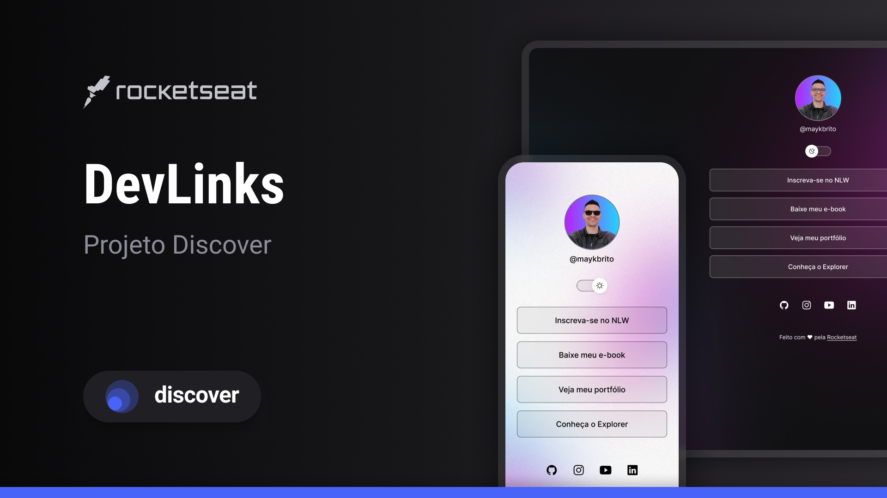

<h1 align="center">DevLinks</h1>

Programa exclusivo e gratuito, promovido pela Rocketseat para 
ensino de tecnologias WEB.

    <a href="#-tecnologias">Tecnologias</a>&nbsp; &nbsp; &nbsp; |&nbsp; 
     &nbsp; &nbsp;
     <a href="#-projeto">Projeto</a>&nbsp; &nbsp; &nbsp; |&nbsp; 
     &nbsp; &nbsp;
     <a href="#-layout">Layout</a>&nbsp; &nbsp; &nbsp; |&nbsp; 
     &nbsp; &nbsp;
     <a href="#memo-licença">Licença</a>&nbsp; &nbsp; &nbsp; |&nbsp; 
     &nbsp; &nbsp;

    

 

     